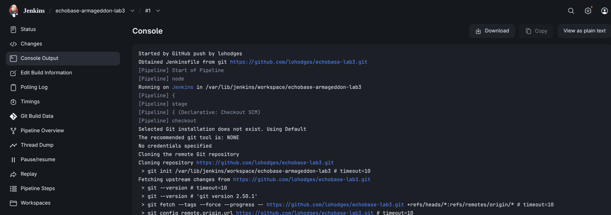
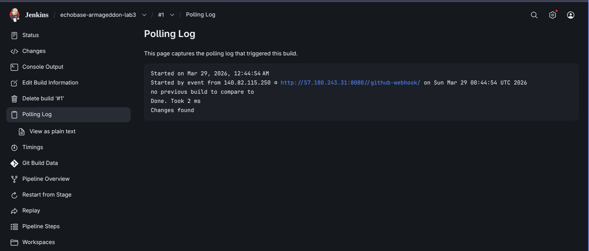

# New Jenkins server test with terraform deployment and triggers

## Jenkinsfile

A simple declarative Jenkinsfile
- Clones git repo 
- Binds AWS IAM user creds in terraform stages with AWS Creds plugin
- Stages for terraform init and apply 
- Destroy stage using user input 

## Terraform script 
- A simple AWS S3 bucket is deployed
- State file is stored in S3 backend 
- S3 bucket name uniqueness is guranteed 

## User data
EC2 startup script to bootstrap Jenkins server


Good afternoon/evening all

This week for class 7 is for people to prove that they're able to continue in class 7 with DevOps and Jenkins, or if they need more foundational work in the single A suite.

This week's lab: you will spin up an s3 in terraform with uploaded pictures/screenshots proving THEO SAID you passed Armageddon (whether directly or via group leader), a link to the Armageddon repo in a text file or markdown file, and a successful webhook invocation of their pipeline. Repo for the pipeline has to be from your own GitHub, and link has to be pasted in the class chat during class so Aaron and Rob can collect. 

Screenshots of Armageddon extensions will not count as a pass. Forked repos will not count as a pass. If your repo is a branch of a team repo, make sure to say so in the readme or text document. Own your work as the high skill professional worth $100/hr you are.

Those who submit their repo link with validations, screenshots, and working code, will get new class code for the following weeks. Next week = snyk scans with Charles Manning (which he gets paid to do)

Those who don't will head to single A/catch up, and can only access class 7 live sessions after passing black Muslims catch up section

No excuses. No exceptions. No "taking notes" or "working it out" or "I need to get caught up". Time to shit or get off the pot. Make the time, get the work done, and show up to class to submit your repo, or head to single A/catch up until you're ready for Jenkins.

class 7 g-check grading rubric

- screenshot: working webhook trigger (empty or otherwise)


- screenshot: successful TF deployment via jenkins



- screenshot: theo's approval of Armageddon submission (PENDING)
- text file/markdown/picture: Armageddon repo link
```
https://github.com/lohodges/echobase


Note:
./lab-3 must be deployed separately from labs 1 and 2
```
- all text/image files uploaded in s3 bucket
- non-forked repo