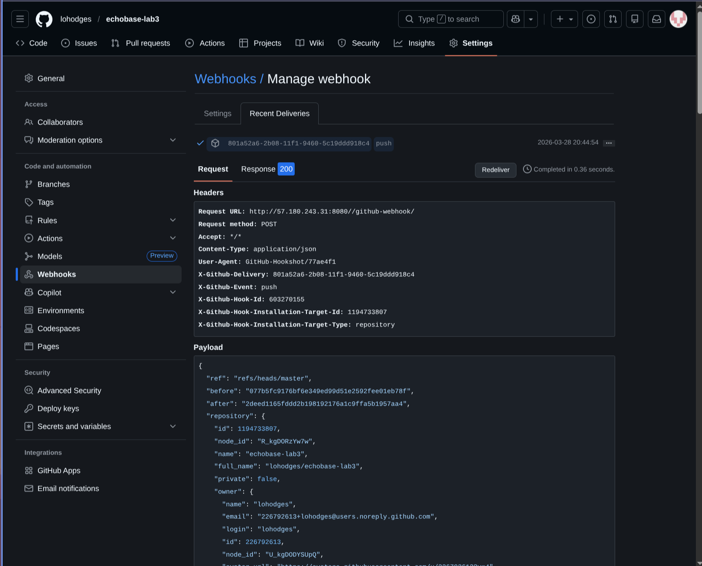
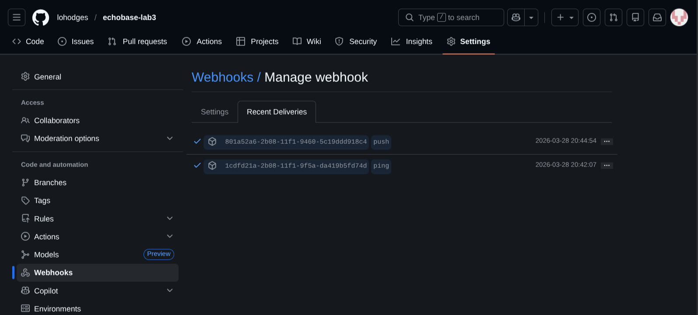
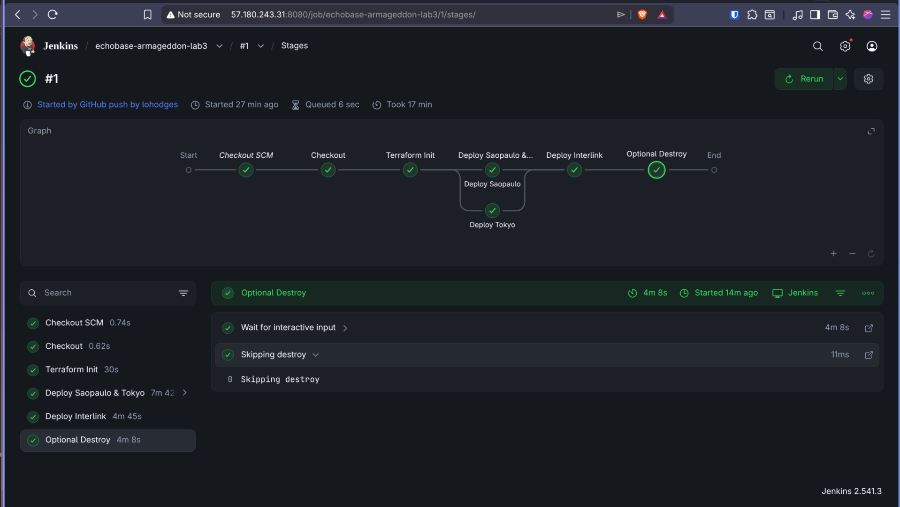
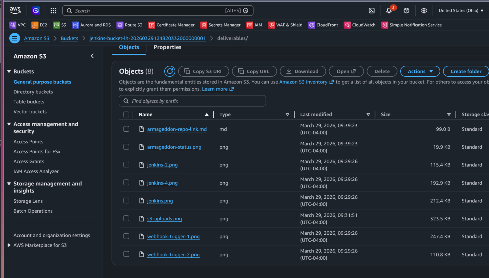

class 7 (3/28/26) - Saturday (working session)
Week 29 (Jenkins wk 4): Class 7 g-check - proof of pipeline understanding

goal = repo link showing proof of a successful Jenkins pipeline run, webhook invocations (empty or otherwise), Terraform code deployment, and Armageddon clearance

Class starting whenever students want to start collaborating


class 7 g-check grading rubric

- screenshot: working webhook trigger (empty or otherwise)
- screenshot: successful TF deployment via jenkins
- screenshot: theo's approval of Armageddon submission
- text file/markdown/picture: Armageddon repo link
- all text/image files uploaded in s3 bucket
- non-forked repo

class 7 g-check grading rubric

- screenshot: working webhook trigger (empty or otherwise)


- screenshot: successful TF deployment via jenkins



- screenshot: theo's approval of Armageddon submission (PENDING)
- text file/markdown/picture: Armageddon repo link
```
https://github.com/lohodges/echobase


Note:
./lab-3 must be deployed separately from labs 1 and 2
```
- all text/image files uploaded in s3 bucket



- non-forked repo

## S3 Bucket Public URLs

| File | URL |
|------|-----|
| armageddon-repo-link.md | `https://jenkins-bucket-lh-20260329181829553400000001.s3.us-east-2.amazonaws.com/deliverables/armageddon-repo-link.md` |
| armageddon-status.png | `https://jenkins-bucket-lh-20260329181829553400000001.s3.us-east-2.amazonaws.com/deliverables/armageddon-status.png` |
| jenkins-2.png | `https://jenkins-bucket-lh-20260329181829553400000001.s3.us-east-2.amazonaws.com/deliverables/jenkins-2.png` |
| jenkins-4.png | `https://jenkins-bucket-lh-20260329181829553400000001.s3.us-east-2.amazonaws.com/deliverables/jenkins-4.png` |
| jenkins.png | `https://jenkins-bucket-lh-20260329181829553400000001.s3.us-east-2.amazonaws.com/deliverables/jenkins.png` |
| s3-uploads.png | `https://jenkins-bucket-lh-20260329181829553400000001.s3.us-east-2.amazonaws.com/deliverables/s3-uploads.png` |
| webhook-trigger-1.png | `https://jenkins-bucket-lh-20260329181829553400000001.s3.us-east-2.amazonaws.com/deliverables/webhook-trigger-1.png` |
| webhook-trigger-2.png | `https://jenkins-bucket-lh-20260329181829553400000001.s3.us-east-2.amazonaws.com/deliverables/webhook-trigger-2.png` |